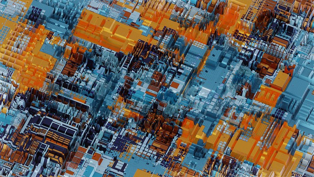

# Hardware attacks / State of the art

  

### Microarchitectural exploitation and other hardware attacks.

#### Contributing:
Contributions, comments and corrections are welcome, please do PR.

#### Flaws:
* [TPM-FAIL / TPM meets Timing and Lattice Attacks](https://tpm.fail/)
    * __[CVE-2019-11090]__ For Intel fTPM
    * __[CVE-2019-16863]__ For STMicroelectronics TPM

* [__[CVE-2015-0565]__ Rowhammer based](https://users.ece.cmu.edu/~yoonguk/papers/kim-isca14.pdf):
    * [__[CVE-2016-6728]__ DRAMMER](https://vvdveen.com/publications/drammer.pdf)
    * [__[CVE-2018-9442]__ RAMPage](https://rampageattack.com/)
    * [__[CVE-2019-0174]__ RAMBleed](https://rambleed.com/)
    * [__[CVE-2019-0162]__ SPOILER / Speculative Load Hazards Boost Rowhammer and Cache Attacks](https://arxiv.org/abs/1903.00446)
    * [__[CVE-2021-42114]__ Blacksmith/ Scalable Rowhammering in the Frequency Domain](https://comsec.ethz.ch/research/dram/blacksmith/)
    * [DRAMA/DRAM Addressing](https://www.usenix.org/conference/usenixsecurity16/technical-sessions/presentation/pessl)
    * [Flip Feng Shui (FFS)](https://www.usenix.org/conference/usenixsecurity16/technical-sessions/presentation/razavi)
    * [SGX-Bomb](https://www.microsoft.com/en-us/research/publication/sgx-bomb-locking-down-the-processor-via-rowhammer-attack/)
    * [Nethammer](https://arxiv.org/abs/1805.04956)
    * [JackHammer](https://arxiv.org/abs/1912.11523)
    * [Half-Double: Next-Row-Over Assisted Rowhammer](https://github.com/google/hammer-kit/blob/9adad960512d511e864bb7854822f0d1b789ac4b/20210525_half_double.pdf)

* __Spectre__:
    * [__[CVE-2017-5753]__ Spectre-V1 / Spectre v1 / Spectre-PHT / Bounds Check Bypass (BCB)](https://meltdownattack.com/)
        * [SGXPectre](https://arxiv.org/abs/1802.09085)
        * [NetSpectre](https://arxiv.org/abs/1807.10535)
        
    * [__[CVE-2018-3693]__ Spectre 1.2 / Meltdown-RW / Read-only protection bypass (RPB)](https://arxiv.org/abs/1807.03757) 	
    * [__[CVE-2017-5715]__ Spectre-V2 / Spectre v2 / Spectre-BTB / Branch Target Injection (BTI)](https://arxiv.org/abs/1807.03757)
        * [__[CVE-2021-26341]__ Specter-BTH / Branch History Injection (BTH)](https://download.vusec.net/papers/bhi-spectre-bhb_sec22.pdf)
    * [__[CVE-2018-9056]__ BranchScope](https://www.researchgate.net/publication/323951622_BranchScope_A_New_Side-Channel_Attack_on_Directional_Branch_Predictor)
    * __SpectreNG class__:
        * [__[CVE-2018-3640]__ Spectre v3a / Meltdown-GP / Rogue System Register Read (RSRR)]()
        * [__[CVE-2018-3639]__ Spectre v4 / Spectre-STL / Speculative Store Bypass (SSB)](https://bugs.chromium.org/p/project-zero/issues/detail?id=1528)
        * [__[CVE-2018-3665]__ LazyFP / Meltdown-NM / Spectre-NG 3 / Lazy FP State Save-Restore](https://arxiv.org/abs/1806.07480)
        * [__[CVE-2018-3693]__ Spectre 1.1 / Spectre-PHT / Bounds Check Bypass Store (BCBS)]()
        * [__[CVE-2019-1125]__ Spectre SWAPGS]()
        
    * [__Foreshadow class__](https://foreshadowattack.eu/):
        * __[CVE-2018-3615]__ Foreshadow / Spectre v5 / L1TF / Meltdown-P / L1 Terminal Fault in SGX
        * __[CVE-2018-3620]__ Foreshadow-NG / Foreshadow-OS
        * __[CVE-2018-3646]__ Foreshadow-NG / Foreshadow-VMM
        
    * __Spectre RSB (Return Mispredict / Return Stack Buffer (RSB)) based__:
        * [__[CVE-2018-15572]__ SpectreRSB](https://arxiv.org/abs/1807.07940)
        * [ret2spec](https://arxiv.org/pdf/1807.10364.pdf)
        
    * __Meltdown (Rogue Data Cache Load (RDCL))__:
        * [__[CVE-2017-5754]__ Meltdown v3 / Spectre v3 / Spectre-V3 / Meltdown-US](https://arxiv.org/abs/1811.05441):
            * Meltdown-BR / Bounds Check Bypass
            * Meltdown-NM / FPU Register Bypass
            * Meltdown-P / Virtual Translation Bypass
            * Meltdown-PK / Protection Key Bypass
            
    * [__Microarchitectural Data Sampling (MDS)__](https://mdsattacks.com/):
        * __[CVE-2018-12126]__ Fallout / Microarchitectural Store Buffer Data Sampling (MSBDS)
        * Rogue In-Flight Data Load (RIDL):
            * [__[CVE-2018-12130]__ ZombieLoad / Microarchitectural Fill Buffer Data Sampling (MFBDS)](https://zombieloadattack.com/)
            * __[CVE-2018-12127]__ Microarchitectural Load Port Data Sampling (MLPDS)
            * __[CVE-2019-11091]__ Microarchitectural Data Sampling Uncacheable Memory (MDSUM)
            * [__[CVE-2019-11135]__ ZombieLoad v2 / TSX Asynchronous Abort (TAA)](https://zombieloadattack.com/)
            * __[CVE-2020-0548]__ Vector Register Sampling (VRS)
            * [__[CVE-2020-0549]__ CacheOut / L1D Eviction Sampling (L1DES)](https://cacheoutattack.com/)
    * [__[CVE-2020-0551]__ Hijacking Transient Execution with Load Value Injection (LVI)](https://lviattack.eu)
    * [__[CVE-2020-0543]__ Crosstalk / Special Register Buffer Data Sampling (SRBDS)](https://download.vusec.net/papers/crosstalk_sp21.pdf)

            
* [__[CVE-2018-5407]__ PortSmash]()
* [__[CVE-2021-30747]__ M1RACLES: M1ssing Register Access Controls Leak EL0 State (covert channel vulnerability in the Apple Silicon "M1" chip)](https://m1racles.com/)
* [ARMageddon](https://arxiv.org/abs/1511.04897v1)
* [Nemesis](https://distrinet.cs.kuleuven.be/software/sancus/publications/ccs18.pdf)
* [__[Lord of the Ring(s)]__ Side Channel Attacks on the CPU On-Chip Ring Interconnect Are Practical](https://arxiv.org/pdf/2103.03443.pdf)
* [__[Augury]__ Using Data Memory-Dependent Prefetchers (DMP) to Leak Data at Rest](https://www.prefetchers.info/augury.pdf)

#### Proof of concepts:
* TPM-Fail: https://github.com/VernamLab/TPM-Fail
* Rowhammer (Google): https://github.com/google/rowhammer-test
* Rowhammer (IAIK): https://github.com/IAIK/rowhammerjs
* DRAMMER: https://github.com/vusec/drammer
* SGX-Bomb: https://github.com/sslab-gatech/sgx-bomb
* SWAPGS: https://github.com/bitdefender/swapgs-attack-poc
* Berkeley Out-of-Order Machine (BOOM) RV64GC RISC-V core Spectre attacks: https://github.com/riscv-boom/boom-attacks

#### Other PoCs:
* [__[spook.js]__ Attacking Google Chrome's Strict Site Isolation via Speculative Execution and Type Confusion](https://www.spookjs.com/)

#### Resources:
* [Linux Kernel Defence Map](https://github.com/a13xp0p0v/linux-kernel-defence-map)
* [Linux Kernel Hardware Vulnerabilities](https://www.kernel.org/doc/html/latest/admin-guide/hw-vuln/index.html)
* [Transient Execution Attacks](https://transient.fail)
* [A Spectre demo written in Javascript for Chrome 88](https://leaky.page)
* [RAM Anatomy Poster](https://goodies.dotnetos.org/files/dotnetos-poster-ram.pdf)
* [speculation-bugs: Docs and resources on CPU Speculative Execution bugs](https://github.com/marcan/speculation-bugs)
* [Interactive guide to speculative execution attacks:](https://mdsattacks.com/diagram.html)

#### Tools:
* [sandsifter](https://github.com/xoreaxeaxeax/sandsifter): The x86 processor fuzzer.
* [OpcodeTester](https://github.com/cattius/opcodetester): Analyse Undocumented Instructions on Intel x86/x86-64 and RISC-V.
* [evsets](https://github.com/cgvwzq/evsets): Tool for testing and finding minimal eviction sets.
* [cachequery](https://github.com/cgvwzq/cachequery): A tool for interacting with hardware memory caches in modern Intel CPUs.
* [haruspex](https://github.com/can1357/haruspex): Exploration of x86-64 ISA using speculative execution.
* [Blacksmith](https://github.com/comsec-group/blacksmith): Next-gen Rowhammer fuzzer that uses non-uniform, frequency-based patterns.

#### Blogs and posts:
* [CPU Introspection: Intel Load Port Snooping](https://gamozolabs.github.io/metrology/2019/12/30/load-port-monitor.html)
* [Sushi Roll: A CPU research kernel with minimal noise for cycle-by-cycle micro-architectural introspection](https://gamozolabs.github.io/metrology/2019/08/19/sushi_roll.html)
* [Pulling Bits From ROM Silicon Die Images: Unknown Architecture](https://ryancor.medium.com/pulling-bits-from-rom-silicon-die-images-unknown-architecture-b73b6b0d4e5d)
* [Beating the L1 cache with value speculation](https://mazzo.li/posts/value-speculation.html)
* [COMSEC (ETH Zürich) Blog](https://comsec.ethz.ch/research/)

#### Other papers:
* [Reverse Engineering of Intel Microcode Update Structure](https://ieeexplore.ieee.org/document/9197630)
* [Security Analysis of AMD predictive store forwarding (AMD Zen 3)](https://www.amd.com/system/files/documents/security-analysis-predictive-store-forwarding.pdf)
* [Flushgeist: Cache Leaks from Beyond the Flush](https://vwzq.net/papers/flushgeist20.pdf)
* [Theory and Practice of Finding Eviction Sets](https://ieeexplore.ieee.org/document/8835261)
* [CacheQuery: Learning Replacement Policies from Hardware Caches](https://arxiv.org/abs/1912.09770)
* [Hardware-Software Contracts for Secure Speculation](https://arxiv.org/abs/2006.03841)
* [Speculative Probing: Hacking Blind in the Spectre Era](https://download.vusec.net/papers/blindside_ccs20.pdf)

#### Others:
> $ cat /sys/devices/system/cpu/vulnerabilities/*
